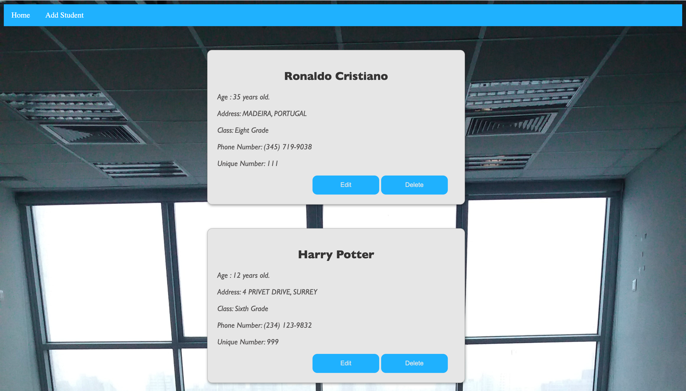

# OVERVIEW
This website uses Django framework to recieve and save school student data in a database. This project uses HTML, CSS, sqlite3, and mainly python.
It uses Visual Studio Code and Django framework.

# DEVELOPMENT ENVIRONMENT
* Visual Studio Code

# EXECUTION
To execute the program: run the file on a web browser.

# USEFUL WEBSITES
* [Django Documentation](https://www.djangoproject.com/)
* [MDN Web Docs Django Tutorial](https://developer.mozilla.org/en-US/docs/Learn/Server-side/Django/Introduction)

